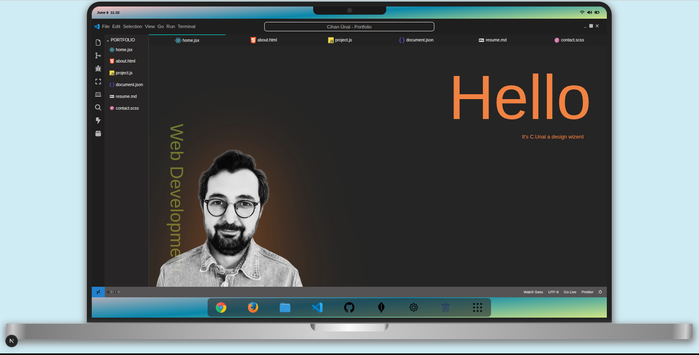

# PORTFOLIO



# My Portfolio

Can be viewed live here: [Portfolio Website](https://portfolio-ten-silk-21.vercel.app/)

---

## About

This is my personal portfolio website showcasing my projects, skills, and professional experience.  
It is designed to highlight my web development abilities and provide easy access to my work.

---

## Features

- **Responsive Design:** Works on desktop, tablet, and mobile devices.
- **Projects Showcase:** Displays my latest projects with links and descriptions.
- **Certifications Page:** Lists my educational and professional certificates.
- **Contact Section:** Visitors can easily reach me via email or social media links.
- **Smooth Navigation:** Smooth scrolling between sections for improved user experience.

---

## Technologies Used

This project was built using modern web development technologies:

- **Frontend:**
  - **React.js / Next.js:** Framework for building server-side rendered and static web applications.
  - **JavaScript / TypeScript:** Core language for application logic.
  - **SCSS / CSS Modules:** Styling components with modular and maintainable CSS.
  - **Framer Motion / Animations:** Smooth animations and interactive elements.

- **Hosting / Deployment:**
  - **Vercel:** Continuous deployment and hosting for the portfolio website.

- **Other Tools:**
  - **Figma / Adobe XD:** Design and UI mockups.
  - **Git & GitHub:** Version control and code management.

---

## How It Was Built

1. **Planning & Design:**
   - Layout and sections were designed in Figma for clarity and visual hierarchy.

2. **Frontend Development:**
   - Created reusable React components for sections like About, Projects, and Certificates.
   - Applied SCSS modules for modular styling and maintainability.
   - Used responsive techniques to ensure the site works on all devices.

3. **Integration & Deployment:**
   - Connected interactive elements like links and smooth scrolling.
   - Deployed to Vercel for live preview and continuous updates.

---

## Usage

You can clone this repository and run it locally:

```bash
git clone https://github.com/yourusername/portfolio.git
cd portfolio
npm install
npm run dev
```
